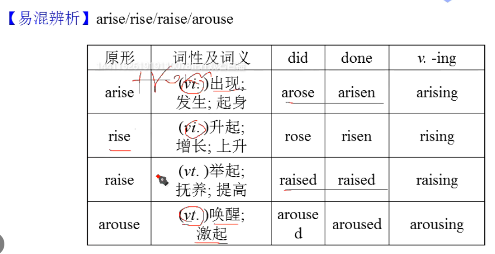
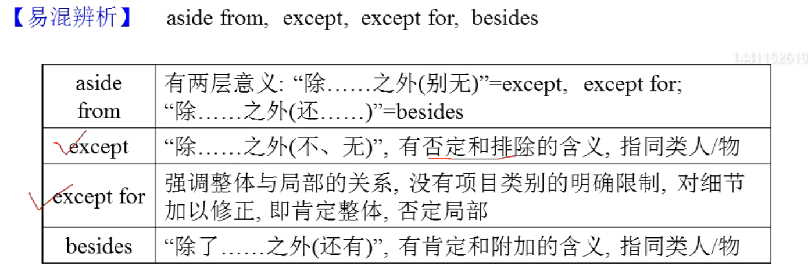

# English  
## italic（斜体）的由来  
斜体字之所以称作italic，是因为其首创者尼克利是___意大利___人。
    尼古拉·尼克利（Niccolo Niccoli,1363-1437）意大利文艺复兴时期的著名文人。尼克利有一个私人图书馆，喜欢收集孤本古籍；由于当时没有复印机，看到别人好书的时候，他只有借书然后手写抄录。大量的抄写提升了尼克利的书法水平，形成了自己独特的向前倾斜的手写体。  
    尼克利去世后，他那前斜流畅的手写体被意大利的第一台打印机所采用，迅速流传到包括英国在内的欧洲国家，并被称为Italic。  
    意大利的字体不都是斜着的，比如还有板正的罗马体。   
    
## 课堂笔记  

  
&emsp;&emsp;&emsp;&emsp;&emsp;&emsp;&emsp;&emsp;&emsp;&emsp;&emsp;&emsp;&emsp;&emsp;&emsp;&emsp;&emsp;&emsp;&emsp;&emsp;&emsp;([返回上一级](../study.md))  
&emsp;&emsp;&emsp;&emsp;&emsp;&emsp;&emsp;&emsp;&emsp;&emsp;&emsp;&emsp;&emsp;&emsp;&emsp;&emsp;&emsp;&emsp;&emsp;&emsp;&emsp;&emsp;&emsp;&emsp;&emsp;&emsp;&emsp;([返回主页](/README.md))