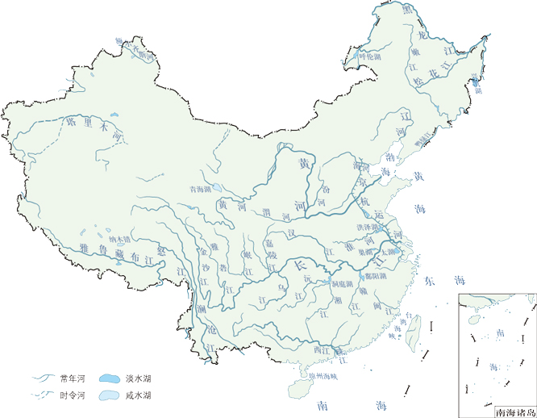
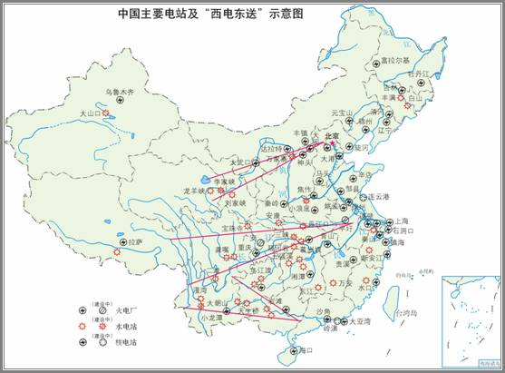
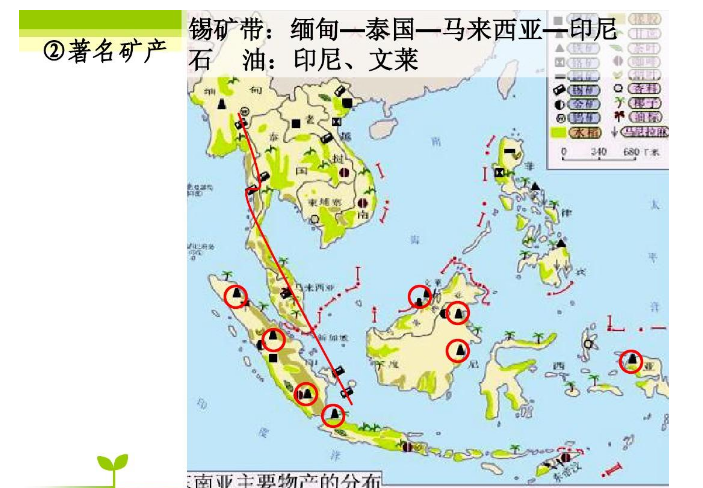
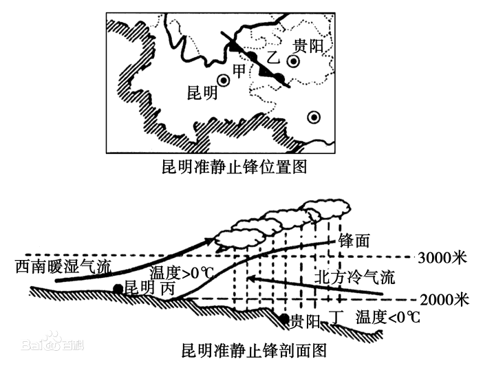
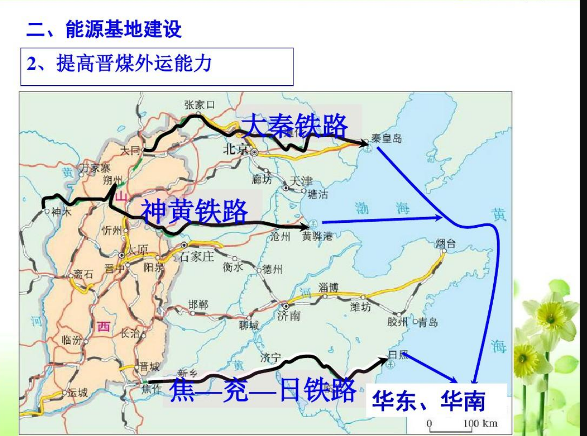

# 地理学习  

  

## 目录
[视频](#视频)  
[8.27 云贵高原+西北地区](#8.27 云贵高原+西北地区)  
[8.26 云贵高原](#8.26 云贵高原)  
[8.25 黄土高原](#8.25 黄土高原)  
[8.23 西北地区](#8.23 西北地区)  
[8.22 青藏高原](#8.22 青藏高原)  
## 视频
> ## 凌汛  
> > [凌汛](https://m.baidu.com/video/page?pd=video_page&nid=15922269383615133406&sign=5353453824506272459&word=%E6%B2%BB%E7%90%86%E5%87%8C%E6%B1%9B%E7%9A%84%E4%B8%BB%E8%A6%81%E6%8E%AA%E6%96%BD&oword=%E6%B2%BB%E7%90%86%E5%87%8C%E6%B1%9B%E7%9A%84%E4%B8%BB%E8%A6%81%E6%8E%AA%E6%96%BD&atn=index&frsrcid=4185&ext=%7B%22jsy%22%3A1%7D&top=%7B%22sfhs%22%3A1%2C%22_hold%22%3A2%7D&sl=2&fr0=B&fr1=B&ms=1&lid=9159854792490471732&_t=1629821268168)  
> > [黄河凌汛成因危害及治理](https://m.baidu.com/video/page?pd=video_page&nid=11556596454919580787&sign=&word=%E5%87%8C%E6%B1%9B+%E6%8E%AA%E6%96%BD&oword=%E5%87%8C%E6%B1%9B+%E6%8E%AA%E6%96%BD&atn=index&frsrcid=4185&ext=%7B%22jsy%22%3A1%7D&top=%7B%22sfhs%22%3A1%2C%22_hold%22%3A2%7D&_t=1629821211372)  
> > [炸冰坝小视频](https://m.baidu.com/vsearch/xsppage?pd=video_page&atn=vertical&dsp=iphone&resource_id=5021&from_sf=1&word=%E7%82%B8%E5%86%B0%E5%9D%9D&title=%E7%82%B8%E5%86%B0%E5%9D%9D_%E5%B0%8F%E8%A7%86%E9%A2%91&top=%7B%22sfhs%22%3A1%2C%22_hold%22%3A2%7D&pn=0&alr=1&sign=209250296002508099&se_signs=6395707046033098696_10611262788416792484_16536677658812779737_8990276448616393123_5417794437353509766_209250296002508099_17562444723865551282&signs=6395707046033098696_10611262788416792484_16536677658812779737_8990276448616393123_5417794437353509766_209250296002508099_17562444723865551282&frsrcid=4660&ms=1&fr0=C&lid=7090315471118370297&referlid=7090315471118370297&ms=1&frsrcid=4660) 
>  
> ## 水土流失  
>     
> > [《中国地理》系列优质微课（43）第六章 黄土高原的水土流失和整治](https://m.baidu.com/video/page?pd=video_page&nid=8716598859482769966&sign=&word=%E9%BB%84%E5%9C%9F%E9%AB%98%E5%8E%9F%E5%BE%AE%E8%AF%BE&oword=%E9%BB%84%E5%9C%9F%E9%AB%98%E5%8E%9F%E5%BE%AE%E8%AF%BE&atn=index&frsrcid=4185&ext=%7B%22jsy%22%3A1%7D&top=%7B%22sfhs%22%3A1%2C%22_hold%22%3A2%7D)  
> > [黄土高原小视频](https://m.baidu.com/vsearch/xsppage?pd=video_page&atn=vertical&dsp=iphone&resource_id=5021&from_sf=1&word=%E9%BB%84%E5%9C%9F%E9%AB%98%E5%8E%9F&title=%E9%BB%84%E5%9C%9F%E9%AB%98%E5%8E%9F_%E5%B0%8F%E8%A7%86%E9%A2%91&top=%7B%22sfhs%22%3A1%2C%22_hold%22%3A2%7D&pn=10&alr=1&sign=5749143453789729792&se_signs=5000739500976819630_9544324789367687807_5749143453789729792_10083994450264379019_11294643369640015096_9255771973644466280_1406111647707194909_3499896195192897938_1899753014123683927_13546574290438486660&signs=5000739500976819630_9544324789367687807_5749143453789729792_10083994450264379019_11294643369640015096_9255771973644466280_1406111647707194909_3499896195192897938_1899753014123683927_13546574290438486660&frsrcid=4660&frsrcid=4660&ms=1&ms=1&fr0=B&fr1=B&lid=8757788958171047282&referlid=8896987933413239018) 

## 课堂笔记
## 8.27 云贵高原+西北地区
### 伊犁河谷降水多的原因？
1. ***向西*** 开口呈 ***喇叭形*** 地形   
2. 西风从 ***大西洋*** 带来海洋湿润气流  
3. 位于山地 ***迎风坡*** ,受地形抬升作用多 ***地形雨***  

### 恒河三角洲（孟加拉湾水灾严重的原因）？
1. 海湾呈口大内小 ***喇叭状***
2. ***天文大潮*** 加剧潮势
3. ***夏季风*** 加剧潮势
4. 恒河正值汛期, ***海水顶托*** 抬高水位
5. 地理位置特殊,是 ***飓风*** 多发区
6. 恒河三角洲 ***地势地平***
7. 三角洲 ***人口密集***

### 油菜播种  
> 南方：冬季  
> 北方：春季  

### 按照农业要素投入  
> 密集农业：投入资金、技术和劳动力多  
> 粗放农业：投入都少  

立体农业  

影响气候的因素  

中国地形图  
  

## 8.26 云贵高原

中国河流图  
  
西电东送  
  
锡矿带  
  
昆明准静止风  
  
春冬小麦  
  
黄土高原成因  
  

## 8.25 黄土高原

### 春寒严重的原因
1. 降水较少且集中于7、8月
2. 春季气温回升快，蒸发旺
3. 春正值农作物播种，冬小麦返青，需水量大

## 8.23 西北地区

### 西气东输、兰新铁路都选择经过河西走廊的原因是什么?（交通区位因素分析）
南为青藏高原，北为内蒙古的西部沙漠地区，此处相对地势平坦，有高山冰雪融水，水源充足，形成了许多绿洲，农业发达，城镇众多。

> # 影响交通的区位因素
> 自然：地形，水文
> 社会经济：农业发达
> 科技
 
### 综合分析西北地区曰然得位对农业生产的影响
__有利影响__
1. 夏季气温高，云量少，光照强，昼夜温差大
2. 牧场广大，宜农荒地多
3. 新疆、河西走廊有冰川融水灌溉，宁夏平原、河套平原有黄河水灌溉
__不利影响__
1. 冬长夏短，寒潮影响大，春季沙尘暴频发
2. 降水少，蒸发强，农业需灌溉，灌溉水源不足
3. 地表植被差，沙漠化严重，河套平原，宁夏平原盐碱化严重

### 三北防护林
地跨东北西部，华北北部和西北大部分地区

### 草方格沙障治沙的利与弊分析
__利(治沙原理)__:能增加地面粗糙，削减风力;截留水分，提高沙层含水量，有利于固沙植物的存活。对于保护交通干线非常有效。  
__弊__:固沙成本高，费工大。  

### 黄河凌汛发生时期
1. 河流封冻时
2. 河流解冻时

### 黄河解决凌汛的措施
1. 炸冰坝
2. 拓宽河道
3. 破冰船破冰

## 8.22 青藏高原
### 珠峰雪线差异及成因
南坡雪线较低，北坡雪线较高  
成因：  
1. 温度（气温）
2. 降水（带来降雪——多则低,少则高）
3. 地貌（坡度-积雪留存难易）

### 珠峰南坡植被较北坡复杂的原因
1. 相对高差
2. 维度
3. 降水

### 青藏高寒区发展农业的有利和不利条件
__有利条件__
1. 光照强度大、时间长
2. 昼夜温差大
__不利条件__
1. 热量不足
2. 干旱、风暴多，土质粗薄

### 青藏高原多咸水湖原因的综合分析
__地形、地势__：多内流湖  
__气候特点__：低温降水少，日照强  
__水循环__：蒸发量大于补给量  

### 青藏高原多沼泽原因的综合分析。
__地形地势__：青藏高原内部较为平坦，排水不畅  
__气候特点__：地势高，气温低  
__土壤特点__：地下冻土广布，下渗能力差  

### 能够回答“光照充足，昼夜温差大”的气候类型

1. 温带季风气候
2. 温带大陆性气候
3. 地中海气候
4. 高山高原气候
5. 热带草原气候
6. 热带沙漠气候

### 题组训练
1. 高原季风形成的主要原因是  
	A.气压带与风带的季节移动  
	B.高原面与海洋表面的热力差异  
	C.高原表面植被的季节变化  
	D高原面与周围白中大气六间的执力羌异  

2. 图中表示夏季风的是  
	A. ab  
	B. bc  
	C. cd  
	D. ad  

  

3. 由于青藏高原的存在而形成的高原季风  
	A.削弱了东亚季风和南亚季风.  
	B.削弱了东亚季风，加强了南亚季风  
	C.加强了东亚季风和南亚季风  
	D.加强了东亚季风，削弱了南亚季风  

解析：  
__高原季风__   
> * 季风成因：大气运动的主因是地面受热不均，青藏高原周围是陆地，而非海洋，故B错，D对。气压带、风带在大陆上被切断,青藏高原上植被较少影响较小。故A、C错。
> * 季风判定：夏季高原面升温比周围大气升温快，气压较低，风由周围吹向高原面，图中由周围吹向高原的是bc。
> * 季风影响：因青藏高原的存在而形成的高原季风与东亚、南亚冬夏季风风向一致，加强了东亚季风和南亚季风，C对。

&emsp;&emsp;&emsp;&emsp;&emsp;&emsp;&emsp;&emsp;&emsp;&emsp;&emsp;&emsp;&emsp;&emsp;&emsp;&emsp;&emsp;&emsp;&emsp;&emsp;&emsp;([返回上一级](../study.md))  
&emsp;&emsp;&emsp;&emsp;&emsp;&emsp;&emsp;&emsp;&emsp;&emsp;&emsp;&emsp;&emsp;&emsp;&emsp;&emsp;&emsp;&emsp;&emsp;&emsp;&emsp;&emsp;&emsp;&emsp;&emsp;&emsp;&emsp;([返回主页](../../README.md))

