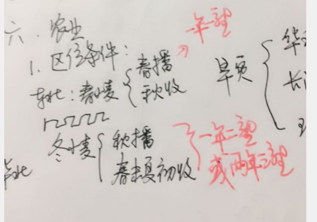

# 地理学习  

  
> ## 凌汛  
> > [凌汛](https://m.baidu.com/video/page?pd=video_page&nid=15922269383615133406&sign=5353453824506272459&word=%E6%B2%BB%E7%90%86%E5%87%8C%E6%B1%9B%E7%9A%84%E4%B8%BB%E8%A6%81%E6%8E%AA%E6%96%BD&oword=%E6%B2%BB%E7%90%86%E5%87%8C%E6%B1%9B%E7%9A%84%E4%B8%BB%E8%A6%81%E6%8E%AA%E6%96%BD&atn=index&frsrcid=4185&ext=%7B%22jsy%22%3A1%7D&top=%7B%22sfhs%22%3A1%2C%22_hold%22%3A2%7D&sl=2&fr0=B&fr1=B&ms=1&lid=9159854792490471732&_t=1629821268168)  
> > [黄河凌汛成因危害及治理](https://m.baidu.com/video/page?pd=video_page&nid=11556596454919580787&sign=&word=%E5%87%8C%E6%B1%9B+%E6%8E%AA%E6%96%BD&oword=%E5%87%8C%E6%B1%9B+%E6%8E%AA%E6%96%BD&atn=index&frsrcid=4185&ext=%7B%22jsy%22%3A1%7D&top=%7B%22sfhs%22%3A1%2C%22_hold%22%3A2%7D&_t=1629821211372)  
> > [炸冰坝小视频](https://m.baidu.com/vsearch/xsppage?pd=video_page&atn=vertical&dsp=iphone&resource_id=5021&from_sf=1&word=%E7%82%B8%E5%86%B0%E5%9D%9D&title=%E7%82%B8%E5%86%B0%E5%9D%9D_%E5%B0%8F%E8%A7%86%E9%A2%91&top=%7B%22sfhs%22%3A1%2C%22_hold%22%3A2%7D&pn=0&alr=1&sign=209250296002508099&se_signs=6395707046033098696_10611262788416792484_16536677658812779737_8990276448616393123_5417794437353509766_209250296002508099_17562444723865551282&signs=6395707046033098696_10611262788416792484_16536677658812779737_8990276448616393123_5417794437353509766_209250296002508099_17562444723865551282&frsrcid=4660&ms=1&fr0=C&lid=7090315471118370297&referlid=7090315471118370297&ms=1&frsrcid=4660) 
>  
> ## 水土流失  
>     
> > [《中国地理》系列优质微课（43）第六章 黄土高原的水土流失和整治](https://m.baidu.com/video/page?pd=video_page&nid=8716598859482769966&sign=&word=%E9%BB%84%E5%9C%9F%E9%AB%98%E5%8E%9F%E5%BE%AE%E8%AF%BE&oword=%E9%BB%84%E5%9C%9F%E9%AB%98%E5%8E%9F%E5%BE%AE%E8%AF%BE&atn=index&frsrcid=4185&ext=%7B%22jsy%22%3A1%7D&top=%7B%22sfhs%22%3A1%2C%22_hold%22%3A2%7D)  
> > [黄土高原小视频](https://m.baidu.com/vsearch/xsppage?pd=video_page&atn=vertical&dsp=iphone&resource_id=5021&from_sf=1&word=%E9%BB%84%E5%9C%9F%E9%AB%98%E5%8E%9F&title=%E9%BB%84%E5%9C%9F%E9%AB%98%E5%8E%9F_%E5%B0%8F%E8%A7%86%E9%A2%91&top=%7B%22sfhs%22%3A1%2C%22_hold%22%3A2%7D&pn=10&alr=1&sign=5749143453789729792&se_signs=5000739500976819630_9544324789367687807_5749143453789729792_10083994450264379019_11294643369640015096_9255771973644466280_1406111647707194909_3499896195192897938_1899753014123683927_13546574290438486660&signs=5000739500976819630_9544324789367687807_5749143453789729792_10083994450264379019_11294643369640015096_9255771973644466280_1406111647707194909_3499896195192897938_1899753014123683927_13546574290438486660&frsrcid=4660&frsrcid=4660&ms=1&ms=1&fr0=B&fr1=B&lid=8757788958171047282&referlid=8896987933413239018) 

## 课堂笔记
## 8.27
### 伊犁河谷降水多的原因？
1. ***向西*** 开口呈 ***喇叭形*** 地形   
2. 西风从 ***大西洋*** 带来海洋湿润气流  
3. 位于山地 ***迎风坡*** ,受地形抬升作用多 ***地形雨***  

### 恒河三角洲（孟加拉湾水灾严重的原因）？
1. 海湾呈口大内小 ***喇叭状***
2. ***天文大潮*** 加剧潮势
3. ***夏季风*** 加剧潮势
4. 恒河正值汛期, ***海水顶托*** 抬高水位
5. 地理位置特殊,是 ***飓风*** 多发区
6. 恒河三角洲 ***地势地平***
7. 三角洲 ***人口密集***

### 油菜播种  
> 南方：冬季  
> 北方：春季  

### 按照农业要素投入  
> 密集农业：投入资金、技术和劳动力多  
> 粗放农业：投入都少  
    
立体农业  

影响气候的因素  

中国地形图  
  

## 8.26

中国河流图  
  
西电东送  
  
锡矿带  
  
昆明准静止风  
  
春冬小麦  
  
黄土高原成因  
  

&emsp;&emsp;&emsp;&emsp;&emsp;&emsp;&emsp;&emsp;&emsp;&emsp;&emsp;&emsp;&emsp;&emsp;&emsp;&emsp;&emsp;&emsp;&emsp;&emsp;&emsp;([返回上一级](../study.md))  
&emsp;&emsp;&emsp;&emsp;&emsp;&emsp;&emsp;&emsp;&emsp;&emsp;&emsp;&emsp;&emsp;&emsp;&emsp;&emsp;&emsp;&emsp;&emsp;&emsp;&emsp;&emsp;&emsp;&emsp;&emsp;&emsp;&emsp;([返回主页](../../README.md))

